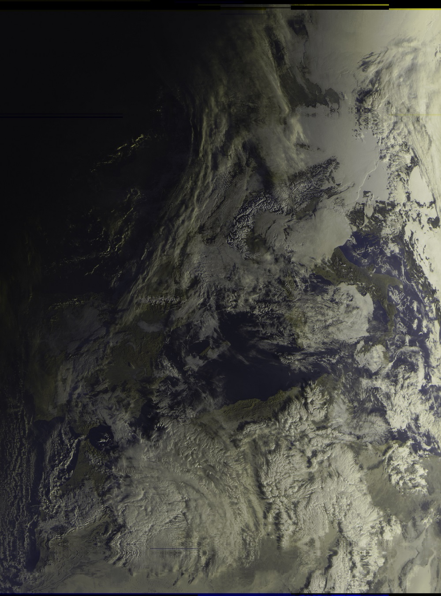
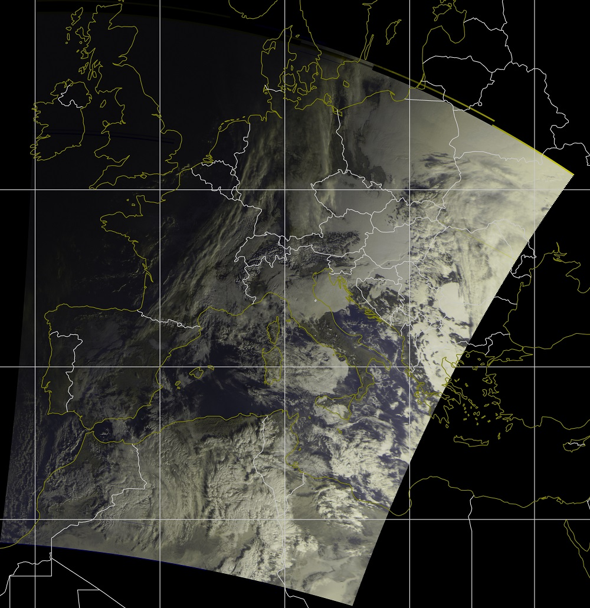
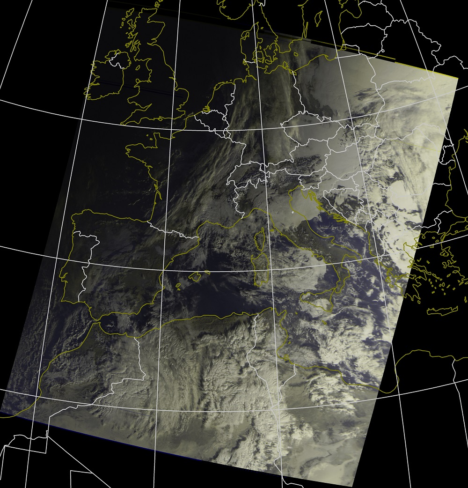
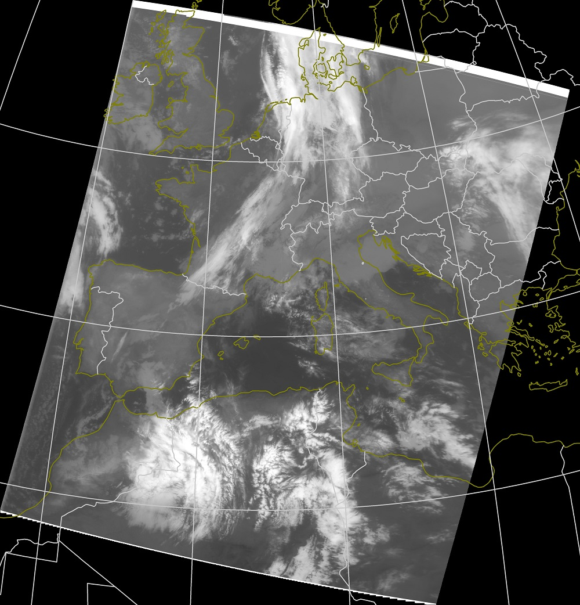
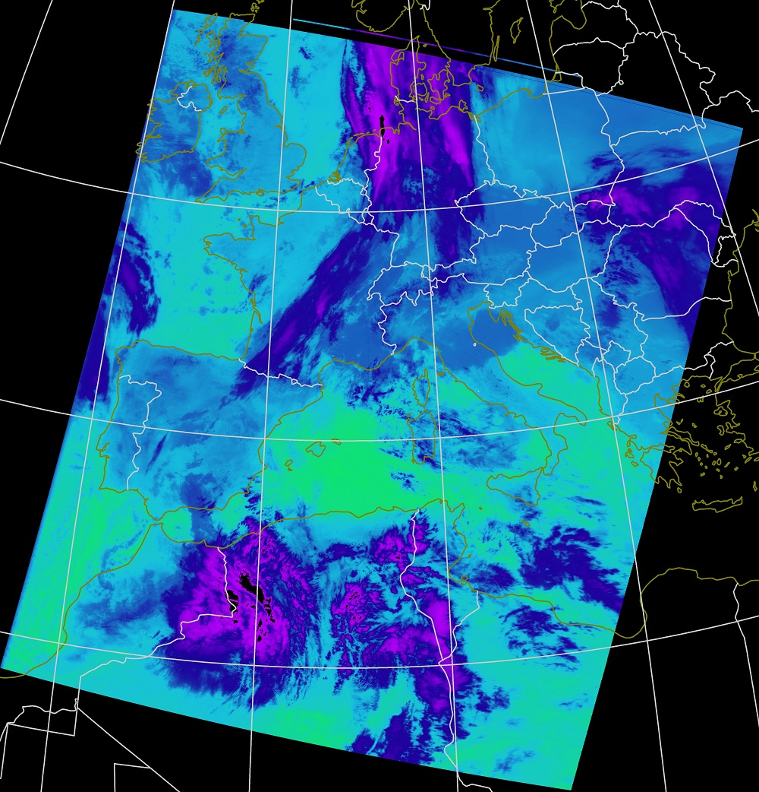

# Meteor Decoder

This project is intended to be a cross platform software to decode METEOR M2 weather satellite data into images. Input file can be ".S" (soft samples) or ".wav" file.
It was created for educational purposes, to learn about satellite communications, how to decode QPSK modulated signals, GIS experiements and all the other stuff that was involved in this project. 

The project is based on 

[http://jmfriedt.free.fr/glmf_meteor_eng.pdf](http://jmfriedt.free.fr/glmf_meteor_eng.pdf)

[https://github.com/infostellarinc/starcoder/tree/master/gr-starcoder/lib/meteor](https://github.com/infostellarinc/starcoder/tree/master/gr-starcoder/lib/meteor)

[https://github.com/artlav/meteor_decoder](https://github.com/artlav/meteor_decoder)

[https://lucasteske.dev/satcom-projects/satellite-projects](https://lucasteske.dev/satcom-projects/satellite-projects)

[https://github.com/dbdexter-dev/meteor_demod](https://github.com/dbdexter-dev/meteor_demod)

[https://github.com/AlexandreRouma/SDRPlusPlus](https://github.com/AlexandreRouma/SDRPlusPlus)

# Detailed tutorial

Thanks to ZL4MDE for the [nice tutorial](https://kiwiweather.com/index.php/2022/12/17/meteordemod-tutorial-for-meteor-m-2/) he wrote about meteordemod. You can find information how to setup a PC for using meteordemod and detailed information about the settings in the settings.ini.

Currently supported outputs are raw channel images, RGB images, IR images. Output projection modes are rectified image, Mercator and Azimuthal Equidistant projection.

## Install using deb package (Only for Raspberry PI)
I've created a debian package for raspberry pi users. There is a limitation though, user home folder must be "/home/pi". 

```
sudo apt install python3-opencv
sudo apt install ./MeteorDemod-x.x.x-Linux.deb
```


## Build and install from sources
For the development QT creator is used, but the qmake is maintained only for windows.

CMAKE is the build system to compile the project. Tested on Windows and Linux(ubuntu, raspbian)

OpenCV must be installed on the system. Required OpenCV modules: core, imgcodecs, imgproc

First install all dependencies:

```
sudo apt install python3-dev python3-pip -y
sudo apt install cmake build-essential pkg-config git -y
sudo apt install libatlas-base-dev liblapacke-dev gfortran -y
```

Build opencv from sources:

```
git clone --depth=1 https://github.com/opencv/opencv.git
cd opencv/
mkdir build && cd build
cmake ../  -DBUILD_LIST=core,imgproc,imgcodecs -DCMAKE_INSTALL_PREFIX=/usr/local -DBUILD_TESTS=OFF -DBUILD_EXAMPLES=OFF -DCMAKE_SHARED_LINKER_FLAGS=-latomic
make -j4
sudo make install
```

Or install it:

```
sudo apt install libopencv-dev python3-opencv -y
```


Then build and install MeteorDemod:

```
git clone --depth=1 https://github.com/Digitelektro/MeteorDemod.git
cd MeteorDemod
git submodule update --init --recursive
mkdir build && cd build
cmake ../
make -j4
sudo make install
```

## Usage
Input parameters:

-sat --satellite Satellite settings name from settings.ini

-t --tle        Two-line element set (TLE) file for calculating overlays

-i --input      Input *.S file or *.wav

-o --output     Optional, folder where generated files will be saved

-f --format     Optional, format of the output images (jpg, bmp, png), default: bmp

-d --date       Optional, specify date for decoding older files (format: dd-mm-yyyy)

-m --mode       Specify modulation type (qpsk or oqpsk, default: qpsk)

-int --int      Deinterleave, needed for 80k mode

-diff --diff    Differential decode, may need for newer satellites

Other settings can be found in the settings.ini file.

### Example command for 80k mode Meteor M2-3: 

``` meteordemod -m oqpsk -int 1 -diff 1 -s 80e3 -sat METEOR-M-2-3 -i input_baseband.wav -t weather.tle -o ./```

## Development
Master branch is for the latest stable version, beta branch for beta versions, development is ongoing on other branches.
 
## Example Outputs

### Spreaded Image



### Mercator projection



### Azimuthal Equidistant projection



### IR Image



### Temperature Image



### Composite IR Image

